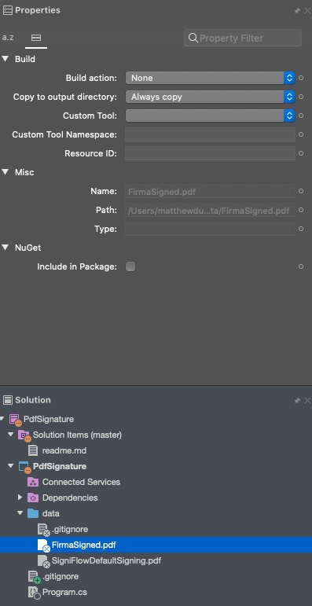

## Basic console app for analysing PDF files

Code copied from https://kb.itextpdf.com/home/it7kb/examples/digital-signatures-chapter-5#Digitalsignatures-chapter5-c5_01_signatureintegrity

**Requires .net core 3.1**

### Instructions

- Place PDF files in data folder
- The PDF files must be copied to the output directory. To do this open the properties in visual studio and select `Always copy` in the `Copy to output directory` dropdown

- Run the app